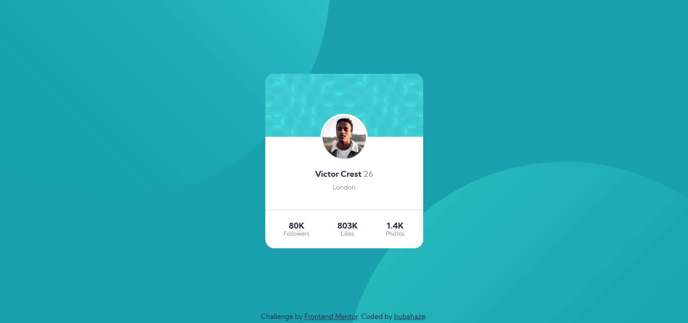

# Frontend Mentor - Profile card component solution

This is a solution to the [Profile card component challenge on Frontend Mentor](https://www.frontendmentor.io/challenges/profile-card-component-cfArpWshJ). Frontend Mentor challenges help you improve your coding skills by building realistic projects. 

## Table of contents

- [Overview](#overview)
  - [The challenge](#the-challenge)
  - [Screenshot](#screenshot)
- [My process](#my-process)
  - [Built with](#built-with)
  - [What I learned](#what-i-learned)
  - [Continued development](#continued-development)
- [Author](#author)

## Overview

### The challenge

- Build out the project to the designs provided

### Screenshot

## My process

No big philosophy, casting spells on the VSCode, and observing changes on browser's window. If I' ve been stuck, I was doing a research on particular issues, i.e. flexbox, positioning etc. (MDN Docs, devdocs, YouTube tutorials).

### Built with

- Semantic HTML5 markup
- Sass/CSS custom properties
- Flexbox
- Desktop-first workflow
- Visual Studio Code

### What I learned

Obviously a lot, as it is my first completed project in HTML/CSS 😆. Among these things is Flexbox, overflow property, basic Sass...

### Continued development

As it is my first attempt of pre-processing CSS with Sass, I'd like to deepen this area, as I find Sass extremely useful and handy 🙌. Media query is the next issue I'd love to particularly master 🔬. Additionally, my aim is to homogenise CSS units, so there are coherent and suitable for various viewports.

## Author

- Github - [bubahaze](https://www.github.com/bubahaze)
- Frontend Mentor - [@bubahaze](https://www.frontendmentor.io/profile/bubahaze)
